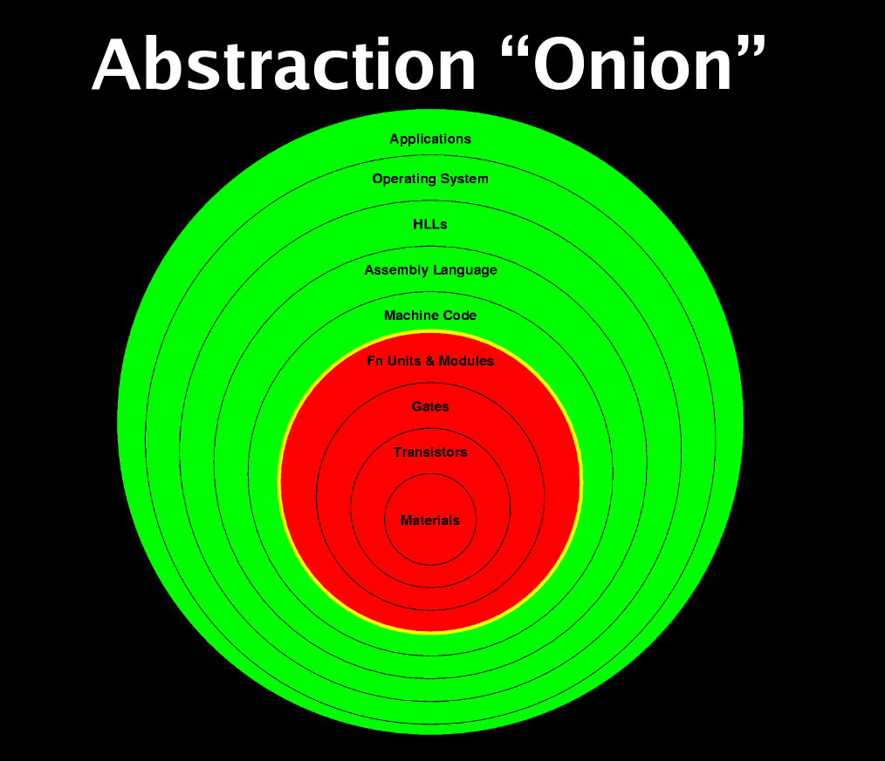

\newpage
# Intro

- yay verilog

- one individual verilog project
- 3 group verilog projects

- 4 homework assignements via canvas

- one in-person comprehensive final
    - course grade is limited to 1 letter above the final!

- MIPS assembly

Parallel processing makes everything faster

