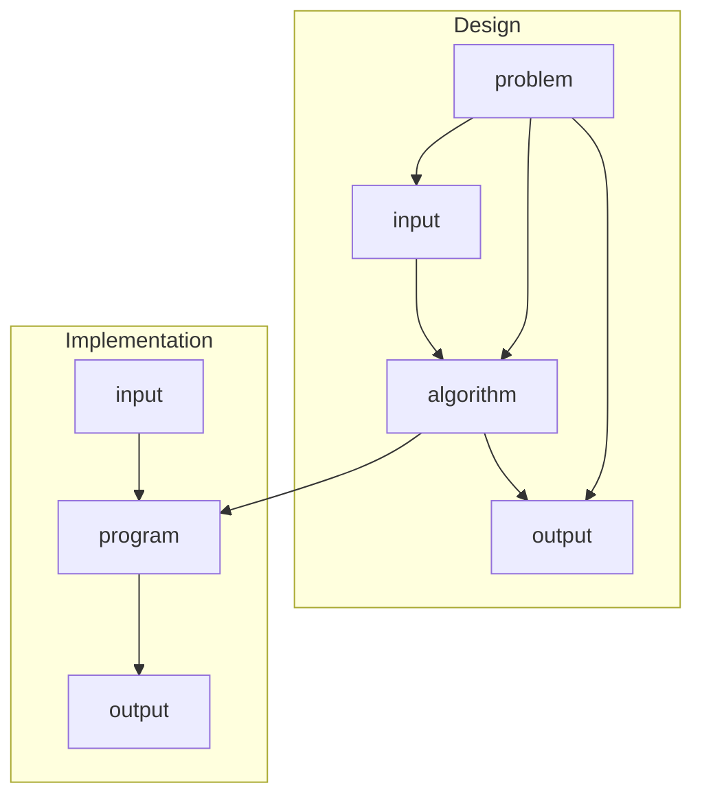

\newpage
# Section 1

## Developing Programs to Solve Problems

designing and implementing solutions to problems.

## Data Structures
- represent data as an abstraction of reality
    - guided by the problem you're trying to solve
- choose an appropriate representation
    - arrays for fast and random access
    - linked lists for easy insertion and deletion
    - hash tables for quick lookups
    - trees and graphs for nonlinear structures
- a data structure is a way to organize, store, and manage data
    - how it's arranged in memory
    - conection between elements
    - what are the elements comprised of
    - rules and operations for acessing or mutating data
- performance drives technical decision for structural implementation
    - how much data do you need to process
    - what do you need to be able to do with the data
    - different data needs different structures
    - different structures have different abilities and restrictions

We will focus on more advanced data structures in this course

\newpage

## Algorithm Design and Analysis

### Algorithm Design
- design an algorithm that meets the requirements of the problem
    - time efficiency
    - storage efficiency
    - additional considerations
    - generally running time is the biggest driver

#### Example 1 Euclidian Algorithm for GCD

Given 2 integers n1 and n2, find their greatest common divisor

$$
n_1 \ge n_2
$$

\begin{center}
sample data
\end{center}
|$n_1$|$n_2$|
|-----|-----|
|78   |30   |

**Algorithm 1:**

is 78 divisible by 30? **no**

is 78 divisible by 29? **no**

is 78 ... 28? **no**

...

is 78 divisible by 6? **yes**

is 30 divisible by 6? **yes**

> 6 is the GCD

This way takes 25 iterations

**Algorithm 2:**

$$
n_1 \bmod n_2 = 78 \bmod 30 = 18
$$
$$
n_1 = 30
$$
$$
n_2 = 18
$$
$$
n_1 \bmod n_2 = 30 \bmod 18 = 12
$$
$$
n_1 = 18
$$
$$
n_2 = 12
$$
$$
n_1 \bmod n_2 = 18 \bmod 12 = 6
$$
$$
n_1 = 12
$$
$$
n_2 = 6
$$
$$
n_1 \bmod n_2 = 6 \bmod 0 = 0
$$
\begin{center}
when $n_2 = 0$, we have found the GCD
\end{center}

> 6 is the GCD

This way takes 4 iterations

This is called the Euclidian algorithm

#### Example 2: Binary Search

Search a set of sorted data by dividing the set in half, determining if the desired value is greater or less than the center element, and then recursing into that half of the set.

A binary search is superior to a sequential search, but requires data to be sorted.

### Algorithm Analysis
- lines of code
- ease of programming (bugs, maintainence)
- storage space
- time (often most important)

Quantify time complexity, as time complexity is generally a multiple of the data volume.

## Topics of this Course
- Data Structures
- Algorithm Design
- Algorithm Analysis
