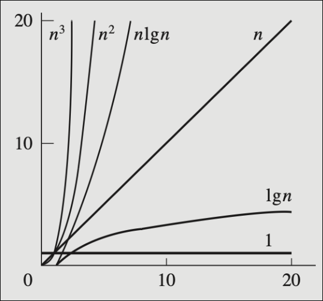

\newpage
# Exam 1 Content

## Algorithm Analysis

### 2.1 Complexity

- Running time is the standard metric
    - relation of running time to input size

- complexity functions are abstractions of things like accesses and actions
    - they show how performance scales with size
    - $f(n)$ where $n$ is the input size
    - each "action" takes one unit of time
    - use the "worst case" longest run

- types of complexity (best to worst)
    1. constant ($1$)
    2. log ($\log n$)
    3. linear ($n$)
    4. linear log ($n \log n$)
    5. polynomial ($n^x$)
        - quadratic ($n^2$)
        - cubic ($n^3$)
    6. exponential ($2^n$)
    7. factorial ($n!$)

{width=200px}

### 2.2 Asymptotic Analysis

- judge algorithms by their worst case, but consider best case and average case

- for asymptotic representation, take out all constants and only use the largest order term
    - e.g. $10n+1$ --> $n$
    - the $10$ and $+1$ are irrelevant at scale and for comparison

- O-notation
    - $O(g(n)) = f(n)$: there exist positive constants $c$ and $n_0$ such that $0 \le f(n) \le c \cdot g(n)$ for all $n \ge n_0$.
    - $O$ notation gives an upper bound of a function, within a constant factor
        - for all values of $n$ at and to the right of $n_0$, $f(n)$ is at or below $c \cdot g(n)$
        - $g(n)$ is the asymptotic upper bound for $f(n)$
        - if $f(n)$ is in $O(g(n))$, the growth rate of $f(n)$ is no more than the growth rate of $g(n)$

- $\Omega$-notation
    - $\Omega(g(n)) = f(n)$ : there exist positive constants $c$ and $n_0$ such that $0 \le c \cdot g(n) \le f(n)$
    - $\Omega$ notation gives a lower bound on a function, for all value of $n$ to the right of $n_0$, $f(n)$ is on or above $c \cdot g(n)$

- $\Theta$-notation
    - there exist $c_1$, $c_2$, and $n_0$ such that $0 \le c_1 \cdot g(n) \le f(n) \le c_2 \cdot g(n)$
    - provides upper and lower bounds
    
## Recursion

- recursive structure: base case and recursive case
    - base case solves a small problem if applicable
    - recursive case:
        - divide
        - conquer
        - combine

- an algorithm containing recursive calls can be described with a recurrence equation
    - when $n$ is small enough ($\lt n_0$), the problem can be solved directly and in constant time ($\Theta(1)$)
    - when $n \gt n_0$, split up the problem and call back

- solving recurrence relations
    - substitution method
        - start with the function
        - replace calls to the function with its contents
        - repeat until a recognizeable series appears
    - recursion tree method
        - start with n
        - draw two branches, each with the portion of n
        - identify the series

## Sorting

### Selection Sort

Repeatedly find the smallest (or largest) element in the list, move it to the next iterated position, and then repeat on the remaining unsorted portion of the list.

### Merge Sort

Split the list into smaller components until they can be sorted easily, then combine the sorted sections. When combining, you just choose from the head of each portion.
