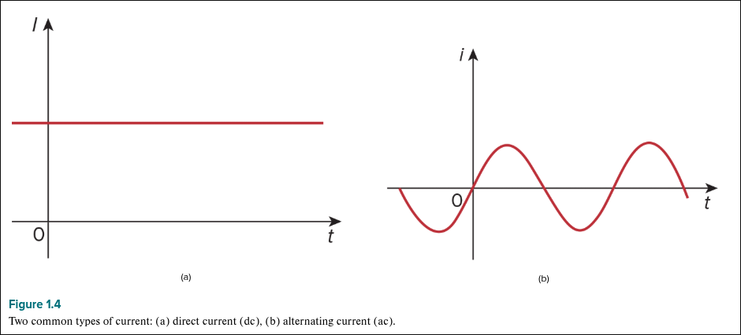
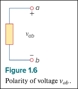

\newpage

# Basic Concepts

## 1.2 SI Units

|Quantity | Basic Unit | Unit Symbol |
|-        |-           |-       |
|Length| meter | $m$
|Mass| kilogram | $kg$
|Time| second | $s$
|Electric Current| ampere (amp) | $A$
|Thermodynamic temperature| kelvin | $K$
|Luminous intensity| candela | $cd$
|Charge| coulomb | $C$

| Multiplier | Prefix | Symbol |
|-----------|--------|--------|
| $10^{18}$ | exa    | $E$    |
| $10^{15}$ | peta   | $P$    |
| $10^{12}$ | tera   | $T$    |
| $10^{9}$  | giga   | $G$    |
| $10^{6}$  | mega   | $M$    |
| $10^{3}$  | kilo   | $k$    |
| $10^{2}$  | hecto  | $h$    |
| $10^{1}$  | deka   | $da$   |
| $10^{0}$  |        | $1$    |
| $10^{-1}$ | deci   | $d$    |
| $10^{-2}$ | centi  | $c$    |
| $10^{-3}$ | milli  | $m$    |
| $10^{-6}$ | micro  | $\mu$  |
| $10^{-9}$ | nano   | $n$    |
| $10^{-12}$| pico   | $p$    |
| $10^{-15}$| femto  | $f$    |
| $10^{-18}$| atto   | $a$    |

\newpage

## 1.3 Charge and Current

|Quantity|Symbol|Units|Unit Symbol|
|--------|------|-----|-----------|
|Charge  | $q$  | Coulomb | $C$ |
|Current | $I$  | Ampere  | $A$ |

### Charge

**Charge is an electrical property of subatomic particles.** An electron has charge $e = -1.602 \times 10^{-19}$C and a proton has charge $-e$ or $+ 1.602 \times 10^{-19}$C. **Electrons have negative charge and protons have positive charge**.

* Coloumbs are *big* and most of the time we'll see $pC$ (pico-coulombs, $10^{-12}$), $nC$ (nano-coulombs, $10^{-9}$), or $\mu C$ (micro-coulombs, $10^{-6}$)

$$
pC < nC < \mu C
$$

* All naturally occurring charges are multiples of $e$
* Charge cannot be created or destroyed, only transferred (conservation of charge): $\sum{q} = \sum{q'}$

### Current

Current is the flow of positive charges through a conductor, which is opposite the flow of electrons.

$$
i \triangleq \frac{dq}{dt}
$$
where $i$ is in Amperes and 1 ampere = 1 coulomb / second

$$
Q \triangleq \int_{t_0}^{t} i ~dt
$$
where $Q$ is the charge transferred

\newpage

### Types of Current

#### DC - Direct Current

Only flows in one direction and can be constant *or time varying*. The distinctive characteristic is that it is unidirectional along each wire.

#### AC - Alternating Current

Reverses direction with respect to time.

\newpage

## 1.4 Voltage

Electromotive force (emf) moves electrons in a conductor. This emf is also known as voltage or potential difference. The voltage $v_{ab}$ between two points $a$ and $b$ in a circuit is the energy needed to move a unit charge from $b$ to $a$.

$$
v_{ab} \triangleq \frac{dw}{dq}
$$
Where $w$ is the energy in joules (J) and $q$ is the charge in coulombs (C).

$$
1 ~ volt = 1 ~ \frac{joule}{coulomb} = 1 ~ \frac{newton \cdot meter}{coulomb}
$$

**Voltage or potential difference is the energy required to move a unit charge from a reference point (-) to another point (+), measured in Volts (V)**.

Voltage is measured from negative to positive.

$$
v_{ab} = -v_{ba}
$$

{width=160px}

\begin{center}
\begin{tikzpicture}
	% Paths, nodes and wires:
	\draw (1, 6) to[european resistor] (1, 9);
	\draw (1, 6) -- (3, 6);
	\draw (1, 9) -- (3, 9);
	\node[ocirc](N1) at (3, 9){} node[anchor=south] at (N1.north){$a$};
	\node[ocirc](N2) at (3, 6){} node[anchor=north] at (N2.text){$b$};
	\node[shape=rectangle, minimum width=0.715cm, minimum height=0.715cm] at (3, 8.625){} node[anchor=north west, align=left, text width=0.327cm, inner sep=6pt] at (2.625, 9){+};
	\node[shape=rectangle, minimum width=0.465cm, minimum height=0.293cm] at (3, 6.25){} node[anchor=north west, align=left, text width=0.077cm, inner sep=6pt] at (2.75, 6.414){-};
	\node[shape=rectangle, minimum width=1.465cm, minimum height=0.715cm] at (2.25, 7.375){} node[anchor=north west, align=left, text width=1.077cm, inner sep=6pt] at (1.5, 7.75){9 V};
	\draw (4.75, 6) to[european resistor] (4.75, 9);
	\draw (4.75, 6) -- (6.75, 6);
	\draw (4.75, 9) -- (6.75, 9);
	\node[ocirc](N3) at (6.75, 9){} node[anchor=south] at (N3.north){$a$};
	\node[ocirc](N4) at (6.75, 6){} node[anchor=north] at (N4.text){$b$};
	\node[shape=rectangle, minimum width=0.34cm, minimum height=0.34cm] at (6.688, 8.688){} node[anchor=north west, align=left, text width=-0.048cm, inner sep=6pt] at (6.5, 8.875){-};
	\node[shape=rectangle, minimum width=0.715cm, minimum height=0.629cm] at (6.75, 6.332){} node[anchor=north west, align=left, text width=0.327cm, inner sep=6pt] at (6.375, 6.664){+};
	\node[shape=rectangle, minimum width=1.465cm, minimum height=0.715cm] at (6, 7.375){} node[anchor=north west, align=left, text width=1.077cm, inner sep=6pt] at (5.25, 7.75){-9 V};
\end{tikzpicture}
\end{center}

Electric current is always *through* and element but voltage is always *across* an element or between two points.

\newpage

## 1.5 Power and Energy

Power is the time rate of expending or absorbing energy, measured in watts (W).

$$
p \triangleq \frac{dw}{dt}
$$

$$
p = \frac{dw}{dt} = \frac{dw}{dq} \cdot \frac{dq}{dt} = v \cdot i
$$

$$
p = v \cdot i
$$
where $p$ is the instantaneous power.

In the **passive sign convention**, current entering through the positive terminal means that power will be $p = v \cdot i$. Current entering through the negative terminal means $p = - v \cdot i$ by this convention.

In the **active sign convention**, this is inverted.

A positive power implies that the element is *consuming* or absorbing power, and a negative power implies that it is producing power.

### Law of Conservation of Energy

$$
\sum p = 0
$$
The total power produced and consumed by a circuit must at all times total zero, because the laws of physics said so.

$$
w = \int_{t_0}^{t} p ~dt = \int_{t_0}^{t} v \cdot i ~dt
$$

> Reminder: $w$ denotes energy and is measured in Joules (J)

$$
1 ~ watt \cdot hour = 3600 ~ J
$$

\newpage

## 1.6 Circuit Elements

### Passive Elements

Passive elements do not generate energy.

### Active Elements

Active elements generate energy.

### Sources

A source (either a voltage source or a current source) produces energy. A source can be either dependent or independent.

A dependent source's output relies on some other value within the circuit. An independent source's output is independent of all other elements.

\begin{center}
\begin{tikzpicture}
	% Paths, nodes and wires:
	\draw (1, 9) to[battery1] (3, 9);
	\draw (1, 8) to[american voltage source] (3, 8);
	\draw (1, 7) to[american current source] (3, 7);
	\node[shape=rectangle, minimum width=4.715cm, minimum height=0.715cm] at (6.125, 8.875){} node[anchor=north west, align=left, text width=4.327cm, inner sep=6pt] at (3.75, 9.25){A battery (Voltage source)};
	\node[shape=rectangle, minimum width=4.715cm, minimum height=0.715cm] at (6.125, 8){} node[anchor=north west, align=left, text width=4.327cm, inner sep=6pt] at (3.75, 8.375){A voltage source};
	\node[shape=rectangle, minimum width=4.715cm, minimum height=0.715cm] at (6.125, 7.125){} node[anchor=north west, align=left, text width=4.327cm, inner sep=6pt] at (3.75, 7.5){A current source};
\end{tikzpicture}
\end{center}

Dependent sources are designated by diamond symbols, instead of circles, and are accompanied by an equation for their output.
